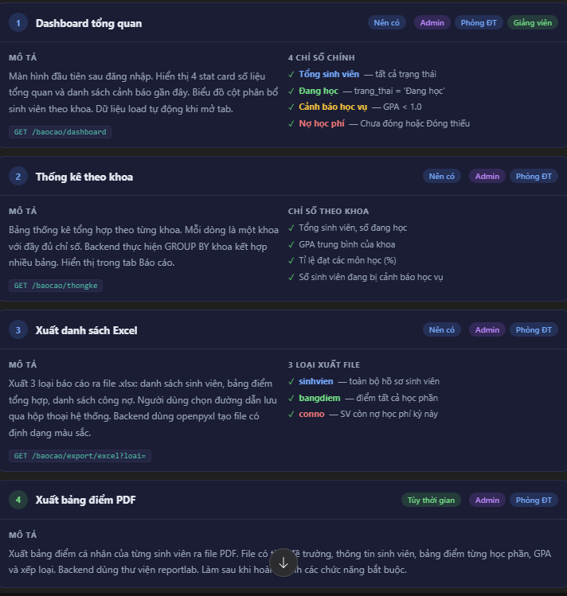

# EduStu

EduStu la ung dung desktop quan ly sinh vien viet bang `PyQt6`, to chuc theo huong `MVC` cho phan frontend. Repo hien tai chua gom backend; frontend giao tiep voi API qua HTTP va mac dinh goi den `http://localhost:8000`.

## Chuc nang hien co

- Dang nhap
- Dashboard tong quan
- Quan ly sinh vien
- Quan ly hoc phan
- Tra cuu va nhap diem
- Theo doi hoc phi va ghi nhan thanh toan
- Xuat bao cao Excel

## Cong nghe

- Python 3
- PyQt6
- requests

## Cau truc repo

```text
EduStu/
|-- Frontend/
|   |-- main.py
|   |-- controllers/
|   |   |-- auth.py
|   |   |-- base.py
|   |   |-- course.py
|   |   |-- grade.py
|   |   |-- report.py
|   |   |-- student.py
|   |   `-- tuition.py
|   |-- models/
|   |   |-- course.py
|   |   |-- grade.py
|   |   |-- student.py
|   |   |-- transcript.py
|   |   |-- tuition.py
|   |   `-- user.py
|   |-- utils/
|   |   |-- config.py
|   |   |-- helpers.py
|   |   `-- session.py
|   `-- views/
|       |-- base_view.py
|       |-- course_view.py
|       |-- dashboard_view.py
|       |-- grade_view.py
|       |-- login_view.py
|       |-- main_window.py
|       |-- report_view.py
|       |-- student_view.py
|       `-- tuition_view.py
|-- requirements.txt
`-- README.md
```

## Kien truc

Frontend duoc tach thanh 4 lop chinh:

- `views/`: giao dien PyQt6
- `controllers/`: validate du lieu, goi API, dieu phoi logic giao dien
- `models/`: dataclass va logic hien thi/nghiep vu nhe
- `utils/`: config, helper format, session dang nhap

`Frontend/main.py` la diem vao cua ung dung. Sau khi dang nhap thanh cong, app mo `MainWindow` va dieu huong sang cac man hinh chuc nang.

## API frontend dang su dung

Frontend hien tai ky vong backend co cac endpoint sau:

- `POST /auth/login`
- `PUT /auth/password`
- `GET /sinhvien`
- `GET /sinhvien/{mssv}`
- `POST /sinhvien`
- `PUT /sinhvien/{mssv}`
- `DELETE /sinhvien/{mssv}`
- `POST /sinhvien/import`
- `GET /hocphan`
- `POST /hocphan`
- `PUT /hocphan/{ma_hp}`
- `DELETE /hocphan/{ma_hp}`
- `GET /dangky/{mssv}`
- `POST /dangky`
- `DELETE /dangky/{id}`
- `GET /diem/{mssv}`
- `POST /diem`
- `PUT /diem/{id}`
- `GET /diem/{mssv}/gpa`
- `GET /hocphi`
- `GET /hocphi/conno`
- `POST /hocphi/thanhtoan`
- `GET /baocao/dashboard`
- `GET /baocao/thongke`
- `GET /baocao/export/excel`

## Cai dat

Tao moi truong ao va cai dependency:

```powershell
cd C:\Users\admin\EduStu
python -m venv .venv
.\.venv\Scripts\Activate.ps1
pip install -r requirements.txt
```

Neu PowerShell chan script, chay tam:

```powershell
Set-ExecutionPolicy -Scope Process -ExecutionPolicy Bypass
```

## Cach chay

Chay frontend:

```powershell
cd C:\Users\admin\EduStu\Frontend
python main.py
```

Hoac neu dang dung virtual environment o root repo:

```powershell
cd C:\Users\admin\EduStu
.\.venv\Scripts\python.exe .\Frontend\main.py
```

## Cau hinh

File cau hinh chinh nam o `Frontend/utils/config.py`.

Gia tri quan trong:

- `POST /auth/login`
- `POST /auth/logout`
- `POST /auth/change-password`
- `GET /dashboard/stats`
- `GET /dashboard/warnings`
- `GET /students`
- `GET /students/{id}`
- `GET /students/{id}/transcript`
- `GET /students/{id}/gpa`
- `POST /students`
- `PUT /students/{id}`
- `GET /courses`
- `GET /courses/{id}`
- `POST /courses`
- `PUT /courses/{id}`
- `DELETE /courses/{id}`
- `GET /grades`
- `POST /grades/bulk`
- `POST /grades/upsert`
- `GET /enrollments`
- `POST /enrollments`
- `DELETE /enrollments/{id}`
- `GET /tuition`
- `GET /tuition/debtors`
- `POST /tuition/pay`

## Viec nen lam tiep

- Tao `requirements.txt`
- Viet `api_client.py`
- Viet `demo_data.py`
- Dong bo ten package `Models` va import `models`
- Them unit test cho logic tinh diem, GPA va hoc phi
- Bo sung giao dien va controller
- Xay dung backend FastAPI hoac chinh sua model de phu hop backend san co 

